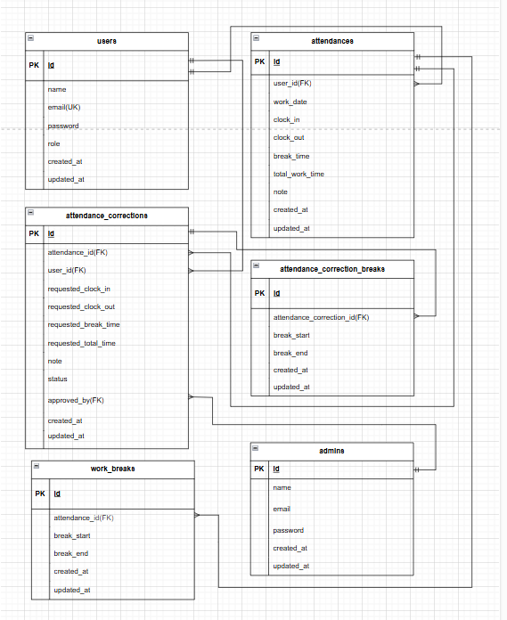

## プロジェクト概要
このプロジェクトは Laravel を用いた勤怠管理アプリです。  
一般ユーザーは会員登録・ログイン後に出勤/退勤/休憩の打刻を行うことができ、  
管理者は承認・修正などを行えます。  

## 環境構築
**Dockerビルド**
1. `git clone git@github.com:towa709/time-card.git`
2. `cd time-card`
3. DockerDesktopアプリを立ち上げる
4. `docker-compose up -d --build`

 上記の手順は任意の作業ディレクトリで実行可能です。  
   例: Linux/WSL 環境では `/home/ユーザー名/coachtech/time-card`、  
   Windows 環境では `C:\Users\ユーザー名\coachtech\time-card` など。

**Laravel環境構築**
1. `docker-compose exec php bash`
2. `composer install`
3. '.env.example'ファイルを コピーして'.env'を作成し、DBの設定を変更
4. `cp .env.example .env`

**注意**
初回ビルド及び.envコピー後、`src/` ディレクトリが root 権限になりますので、以下を必ずプロジェクトのルートディレクトリで実行して権限を修正してから保存してください。  
```bash
sudo chown -R $(whoami):$(whoami) .
```
``` text
DB_CONNECTION=mysql
DB_HOST=mysql
DB_PORT=3306
DB_DATABASE=laravel_db
DB_USERNAME=laravel_user
DB_PASSWORD=laravel_pass

MAIL_FROM_ADDRESS=example@test.com
MAIL_FROM_NAME="time-card App"

```

5. アプリケーションキーの作成
``` bash
docker-compose exec php bash
php artisan key:generate
```

6. マイグレーションの実行
``` bash
docker-compose exec php bash
php artisan migrate --seed
```
※エラーが出た場合、下記を実行して再度、マイグレーション実行。
```bash
docker-compose down
docker volume ls
# 残っているボリュームがあれば削除してから再ビルド。
# 例）time-card_db_data が表示された場合のみ削除：
# docker volume rm time-card_db_data
docker-compose up -d --build
docker ps
# 再びマイグレーション
php artisan migrate --seed
```
※これでマイグレーションとデータ投入は完了です。
## テストユーザー情報
Seeder によって以下のユーザーが登録済みです。ログイン確認に使用してください。

### 👨‍💼 管理者アカウント
| 項目 | 内容 |
|------|------|
| 名前 | 山田 太郎 |
| メールアドレス | admin@example.com |
| パスワード | password123 |

管理者ログインURL  
👉 [http://localhost/admin/login]

### 🧍‍♀️ 一般ユーザーアカウント
| No | 名前 | メールアドレス | パスワード |
|----|------|----------------|-------------|
| 1 | 佐藤 太郎 | user01@example.com | password123 |
| 2 | 鈴木 花子 | user02@example.com | password123 |
| 3 | 高橋 健 | user03@example.com | password123 |
| 4 | 田中 美咲 | user04@example.com | password123 |
| 5 | 伊藤 翔 | user05@example.com | password123 |
| 6 | 渡辺 直子 | user06@example.com | password123 |
| 7 | 山本 大輔 | user07@example.com | password123 |
| 8 | 中村 由美 | user08@example.com | password123 |
| 9 | 小林 誠 | user09@example.com | password123 |
| 10 | 加藤 さくら | user10@example.com | password123 |

---

7.  アクセス時に Permission denied エラーが出る場合は以下を実行してください。（http://localhost/login）
```bash
docker-compose exec php bash
chown -R www-data:www-data storage bootstrap/cache
chmod -R 775 storage bootstrap/cache
```

8. テスト用データベースの作成  
テストは `laravel_test_db` データベースを使用します。  
初回のみ以下を実行して DB を作成してください。

```bash
docker-compose exec mysql bash
mysql -u root -p
```

MySQL コンソールに入ったら以下を入力：
```bash
CREATE DATABASE laravel_test_db CHARACTER SET utf8mb4 COLLATE utf8mb4_unicode_ci; 
GRANT ALL PRIVILEGES ON laravel_test_db.* TO 'laravel_user'@'%';
FLUSH PRIVILEGES;
EXIT;
```
これでテスト用 DB が準備されます。

9. テストの実行
```bash
docker-compose exec php bash
php artisan test --env=testing
```
### ⚠️ トラブルシューティング：初回アクセス時に「419 Page Expired」が表示される場合

環境構築直後に http://localhost/login へアクセスすると、
セッション関連の不整合により「419 | Page Expired」が表示される場合があります。

その場合は、以下のコマンドを実行して修正してください。
``` bash
docker-compose exec php bash
php artisan session:table
php artisan migrate
php artisan config:clear
php artisan cache:clear
php artisan view:clear
chmod -R 777 storage bootstrap/cache
exit
```
また、💡 .env 設定確認（参考）

以下の設定が含まれていることを確認してください：
``` text
SESSION_DRIVER=database
SESSION_DOMAIN=localhost
```

変更した場合は必ず設定を再読み込みしてください。
```bash
php artisan config:clear
```

## ER図



## URL
- 開発環境：http://localhost/login
- phpMyAdmin: http://localhost:8080
- MailHog: http://localhost:8025

## 使用技術
- Laravel 12
- PHP 8.2
- MySQL 8.0
- Docker / docker-compose
- Nginx
- MailHog
- phpMyAdmin

## 追加仕様

### 🧍‍♀️ 一般ユーザーの申請一覧画面
- 対象の申請が存在しない場合は、「対象の申請はありません。」の文言が表示されます。

### 👨‍💼 管理者ユーザーの勤怠一覧画面
- 勤務実績がないユーザーも一覧に表示される仕様になっています。  
  管理者は全ユーザーの出勤・退勤状況を一目で確認できます。
- CSV出力機能の出力項目は以下の通りです：

| 項目名 | 内容 |
|--------|------|
| 日付 | 勤務日 |
| 出勤 | 出勤時刻 |
| 退勤 | 退勤時刻 |
| 休憩合計 | 休憩時間の合計 |
| 勤務時間 | 実際の勤務時間 |

### 🕒 休憩入力フィールドの仕様
- 「休憩回数分のレコードと、追加で1つ分の入力フィールドを表示する」仕様ですが、  
  勤務実績がない日は一般ユーザー・管理者ともに休憩を取っていないため、  
  休憩入力欄は1つのみ表示される仕様になっています。

> 上記の追加仕様は、コーチの許可を得て実装しています。